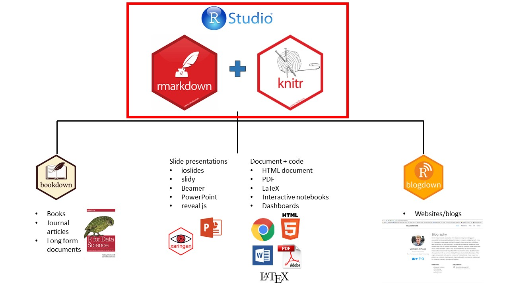
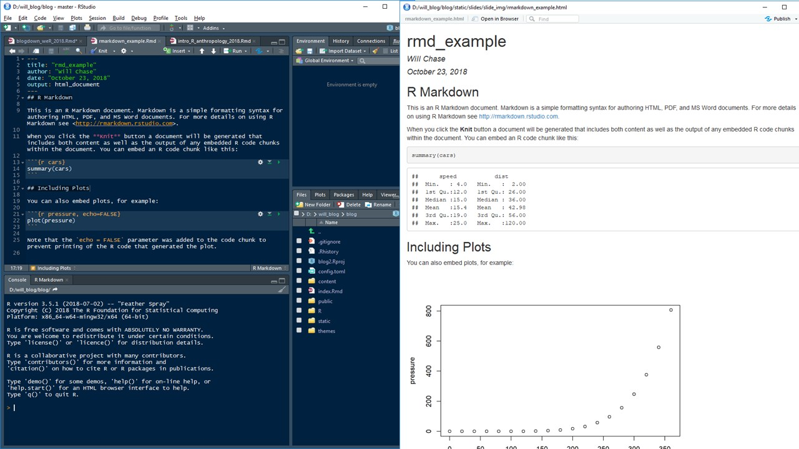
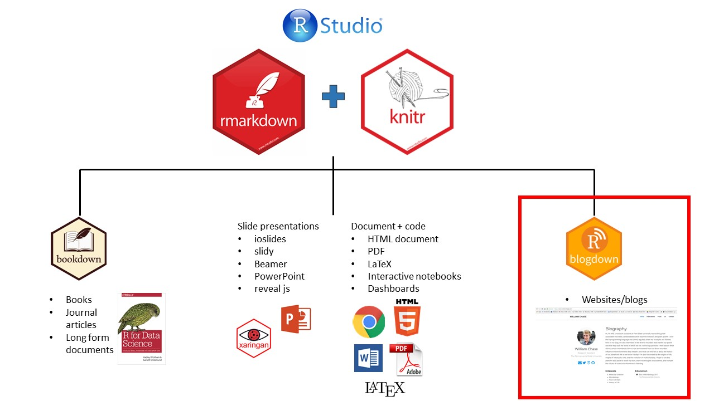
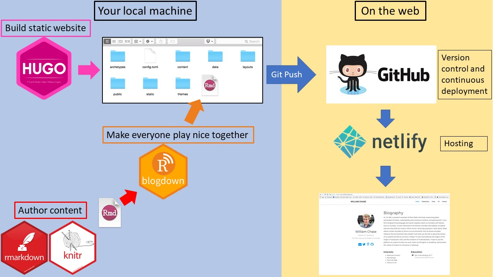

exclude: true
<style type="text/css">
code.r{
  font-size: 16px;
}
pre {
  font-size: 16px !important;
}
</style>
```{r setup, include=FALSE}
options(htmltools.dir.version = FALSE)
```
---
class: bg-main1
#What are we going to cover?
</br></br></br>
--

##What is Blogdown? Why should I use it?

--
##Building and customizing a website

--
##Pro tips and where to learn more

---
class: bg-main1
# The Rmarkdown Universe

.center[]
---
class: bg-main1
# The Rmarkdown Universe

.center[]
---
class: bg-main1
# Rmarkdown: combine code and text
.center[]
---
class: bg-main1
# You can do .yellow[whaaaat]?

.font_large[Some things you can do in rmarkdown:

+ collapsable text/code</br></br>
+ embedded html widgets or shiny apps</br></br>
+ multiple tabs</br></br>
+ fancy bootstrap styling</br></br>
+ execute non-R code (SQL, python, C++, Java, more)</br></br>
+ pretty much anything if you know some HTML/CSS</br></br>
]
---
class: bg-main1
# The Rmarkdown Universe

.center[]
---
class: bg-main1
# The Rmarkdown Universe

.center[]
---
class: bg-main1
# Why use .yellow[Blogdown]?
---
class: bg-main1 split-25
.row[
# Why use .yellow[Blogdown]?
</br></br>
]
.row[
.split-two[
.column[
## Blogdown is .yellow[fast]
]
.column[

]
]
]
---
class: bg-main1 split-25
.row[
# Why use .yellow[Blogdown]?
</br></br>
]
.row[
.split-two[
.column[
## Blogdown is .yellow[fast]
</br></br>
## If you blog about .yellow[R], Blogdown is for you!
]
.column[

]
]
]
---
class: bg-main1 split-25
.row[
# Why use .yellow[Blogdown]?
</br></br>
]
.row[
.split-two[
.column[
## Blogdown is .yellow[fast]
</br></br>
## If you blog about .yellow[R], Blogdown is for you!
</br></br>
## Blogdown gives you .yellow[control]!
]
.column[

]
]
]
---
class: bg-main1
# A Blogdown roadmap
.center[]
---
class: bg-main1
# Step 1: .yellow[setup]

.font_large[`install.packages("blogdown")`]

## If you don't have one, make a GitHub account, install git, and connect your Rstudio to GitHub
.font_large[Follow this tutorial: <a href="http://r-pkgs.had.co.nz/git.html" target="_blank">http://r-pkgs.had.co.nz/git.html</a>]
</br></br>
--
</br></br>
## Browse the Hugo themes and decide on your favorite (I use the Academic theme)
</br>
.font_large[<a href="https://themes.gohugo.io/" target="_blank">https://themes.gohugo.io/</a>]
---


