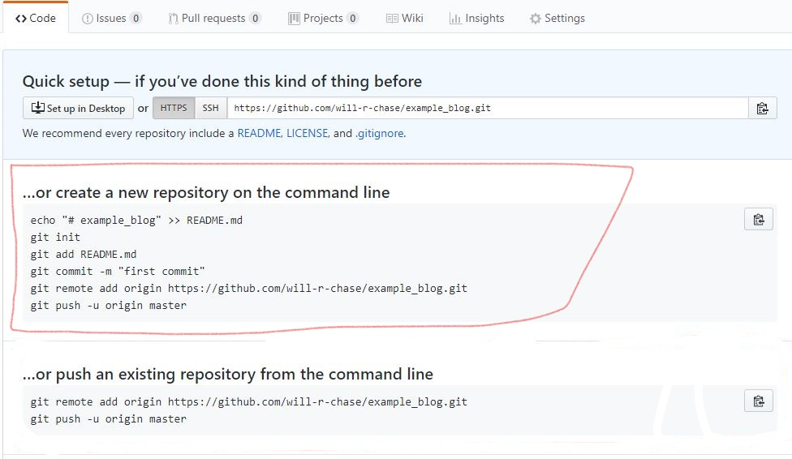

exclude: true
<style type="text/css">
code.r{
  font-size: 16px;
}
pre {
  font-size: 16px !important;
}
</style>
```{r setup, include=FALSE}
options(htmltools.dir.version = FALSE)
```
---
class: split-two
<link rel="stylesheet" href="https://cdnjs.cloudflare.com/ajax/libs/font-awesome/4.7.0/css/font-awesome.min.css">
.column.bg-main1[
.font4[Making websites in R with the Blogdown package]
</br></br></br></br>
.font3[Will Chase]
.font_large[We R: PSU useR group</br>
Oct 29, 2018]
</br>
.font_large[
<ul class="fa-ul">
				<li><i class="fa-li fa fa-envelope" id="icon"></i><a href="mailto:wchase14@gmail.com" target="_blank">wchase14@gmail.com</a></li>
				<li><i class="fa-li fa fa-user" id="icon"></i><a href="williamrchase.com" target="_blank">williamrchase.com</a></li>
        <li><i class="fa-li fa fa-github" id="icon"></i><a href="https://github.com/will-r-chase" target="_blank">github.com/will-r-chase</a></li>
        <li><i class="fa-li fa fa-twitter" id="icon"></i><a href="https://twitter.com/W_R_Chase" target="_blank">@W_R_Chase</a></li>
			</ul>
]
]
.column.bg-main3.center[

]
---
class: bg-main1 split-two
.column[
#Women’s visibility in academic seminars: Women ask fewer questions than men
</br></br></br>
##Alecia J. Carter , Alyssa Croft, Dieter Lukas, Gillian M. Sandstrom
##2018
]
.column[

]

---
class: bg-main1
#Can we try something?
</br></br></br>
--

##If you have questions, please tweet (do @ me) or email me
</br></br>
##You can write down your questions and I'll give a minute at the end to send them to me
</br></br>
##At the end I will pick questions and we can discuss
--
.corner-box.top-right[Questions: @W_R_Chase or wchase14@gmail.com]
---
class: bg-main1
.corner-box.top-right[Questions: @W_R_Chase or wchase14@gmail.com]
#What are we going to cover?
</br></br></br>
--

##What is Blogdown? Why should I use it?

--
##Building and customizing a website

--
##Pro tips and where to learn more

---
class: bg-main1
.corner-box.top-right[Questions: @W_R_Chase or wchase14@gmail.com]
# The Rmarkdown Universe

.center[]
---
class: bg-main1
.corner-box.top-right[Questions: @W_R_Chase or wchase14@gmail.com]
# The Rmarkdown Universe

.center[]
---
class: bg-main1
.corner-box.top-right[Questions: @W_R_Chase or wchase14@gmail.com]
# Rmarkdown: combine code and text
.center[]
---
class: bg-main1
.corner-box.top-right[Questions: @W_R_Chase or wchase14@gmail.com]
# You can do .yellow[whaaaat]?

.font_large[Some things you can do in rmarkdown:

+ collapsable text/code</br></br>
+ embedded html widgets or shiny apps</br></br>
+ multiple tabs</br></br>
+ fancy bootstrap styling</br></br>
+ execute non-R code (SQL, python, C++, Java, more)</br></br>
+ pretty much anything if you know some HTML/CSS</br></br>
]
---
class: bg-main1
.corner-box.top-right[Questions: @W_R_Chase or wchase14@gmail.com]
# The Rmarkdown Universe

.center[]
---
class: bg-main1
.corner-box.top-right[Questions: @W_R_Chase or wchase14@gmail.com]
# The Rmarkdown Universe

.center[]
---
class: bg-main1
.corner-box.top-right[Questions: @W_R_Chase or wchase14@gmail.com]
# Why use .yellow[Blogdown]?
---
class: bg-main1 split-25
.corner-box.top-right[Questions: @W_R_Chase or wchase14@gmail.com]
.row[
# Why use .yellow[Blogdown]?
</br></br>
]
.row[
.split-two[
.column[
## Blogdown is .yellow[fast]
]
.column[

]
]
]
---
class: bg-main1 split-25
.corner-box.top-right[Questions: @W_R_Chase or wchase14@gmail.com]
.row[
# Why use .yellow[Blogdown]?
</br></br>
]
.row[
.split-two[
.column[
## Blogdown is .yellow[fast]
</br></br>
## If you blog about .yellow[R], Blogdown is for you!
]
.column[

]
]
]
---
class: bg-main1 split-25
.corner-box.top-right[Questions: @W_R_Chase or wchase14@gmail.com]
.row[
# Why use .yellow[Blogdown]?
</br></br>
]
.row[
.split-two[
.column[
## Blogdown is .yellow[fast]
</br></br>
## If you blog about .yellow[R], Blogdown is for you!
</br></br>
## Blogdown gives you .yellow[control]!
]
.column[

]
]
]
---
class: bg-main1
.corner-box.top-right[Questions: @W_R_Chase or wchase14@gmail.com]
# A Blogdown roadmap
.center[]
---
class: bg-main1
.corner-box.top-right[Questions: @W_R_Chase or wchase14@gmail.com]
# Step 1: .yellow[setup]

.font_large[`install.packages("blogdown")`]

## If you don't have one, make a GitHub account, install git, and connect your Rstudio to GitHub
.font_large[Follow this tutorial: <a href="http://r-pkgs.had.co.nz/git.html" target="_blank">http://r-pkgs.had.co.nz/git.html</a>]
</br></br>
--
</br></br>
## Browse the Hugo themes and decide on your favorite (I use the Academic theme)

.font_large[<a href="https://themes.gohugo.io/" target="_blank">https://themes.gohugo.io/</a>]
---
class: bg-main1
.corner-box.top-right[Questions: @W_R_Chase or wchase14@gmail.com]
#Step 1: .yellow[build] your website (only takes 3 clicks!)

.float-left[]
.float-right[]
---
class: bg-main1
.corner-box.top-right[Questions: @W_R_Chase or wchase14@gmail.com]
#Step 1: .yellow[build] your website
.center[]
---
class: bg-main1
#Preview with `blogdown::serve_site()`
.corner-box.top-right[Questions: @W_R_Chase or wchase14@gmail.com]
.float-left[]
.float-right[]
---
class: bg-main1
.corner-box.top-right[Questions: @W_R_Chase or wchase14@gmail.com]
.center[]
---
class: bg-main1
#This is your website... isn't that amazing!?
.corner-box.top-right[Questions: @W_R_Chase or wchase14@gmail.com]
.center[]
---
class: bg-main1
.corner-box.top-right[Questions: @W_R_Chase or wchase14@gmail.com]
#Step 2: .yellow[Connect] your website to github
.float-left[]
.float-right[]
---
class: bg-main1
.corner-box.top-right[Questions: @W_R_Chase or wchase14@gmail.com]
#Step 2: .yellow[Connect] your website to github
.center[]
---
class: bg-main1
.corner-box.top-right[Questions: @W_R_Chase or wchase14@gmail.com]
#Step 2: .yellow[Connect] your website to github

### Go to Rstudio and open a terminal (Tools>Terminal>New Terminal)
--

### Type `git init` then restart Rstudio
--

---
class: bg-main1
.corner-box.top-right[Questions: @W_R_Chase or wchase14@gmail.com]
#Step 2: .yellow[Connect] your website to github
</br></br>
`git add ` > ` git commit -m "initial commit"`
</br> 

---
class: bg-main1
.corner-box.top-right[Questions: @W_R_Chase or wchase14@gmail.com]
#Step 2: .yellow[Connect] your website to github
</br></br></br>
###Go back to your terminal and type the two lines from GitHub </br></br>
###`git remote add origin YOUR_REPO`</br></br>
###`git push -u origin master`
---
class: bg-main1
.corner-box.top-right[Questions: @W_R_Chase or wchase14@gmail.com]
#Step 3: .yellow[Deploy] your website
</br></br></br>
###Go to <a href="https://www.netlify.com/" target="_blank">https://www.netlify.com/</a>
</br>

---
class: bg-main1
.corner-box.top-right[Questions: @W_R_Chase or wchase14@gmail.com]
#Step 3: .yellow[Deploy] your website
.center[]
---
class: bg-main1
.corner-box.top-right[Questions: @W_R_Chase or wchase14@gmail.com]
#Step 3: .yellow[Deploy] your website
.center[]
---
class: bg-main1
.corner-box.top-right[Questions: @W_R_Chase or wchase14@gmail.com]
#Step 3: .yellow[Deploy] your website
</br></br></br>
##That's it, your website is up and running!
--

##Things you should do:
###-Change name of site</br></br>
###-Set up https</br></br>
###-Set up disqus comments and google analytics
---

