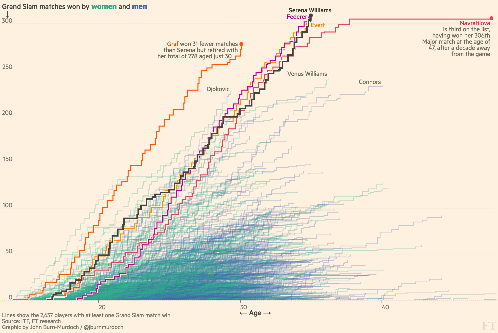
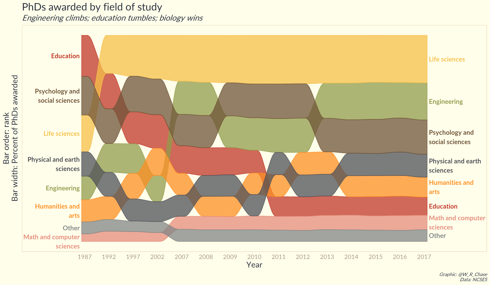
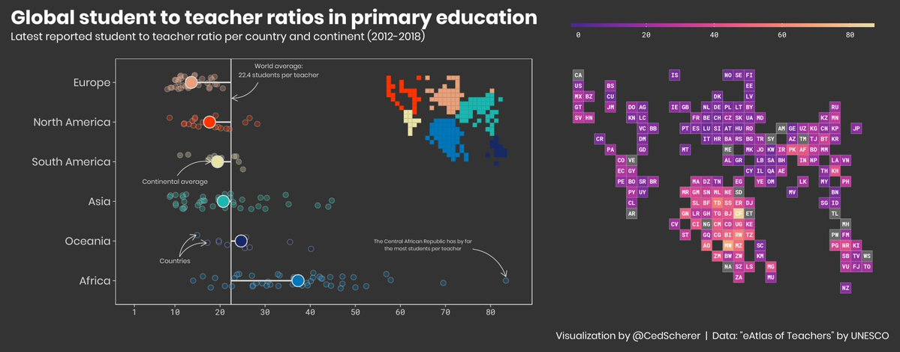
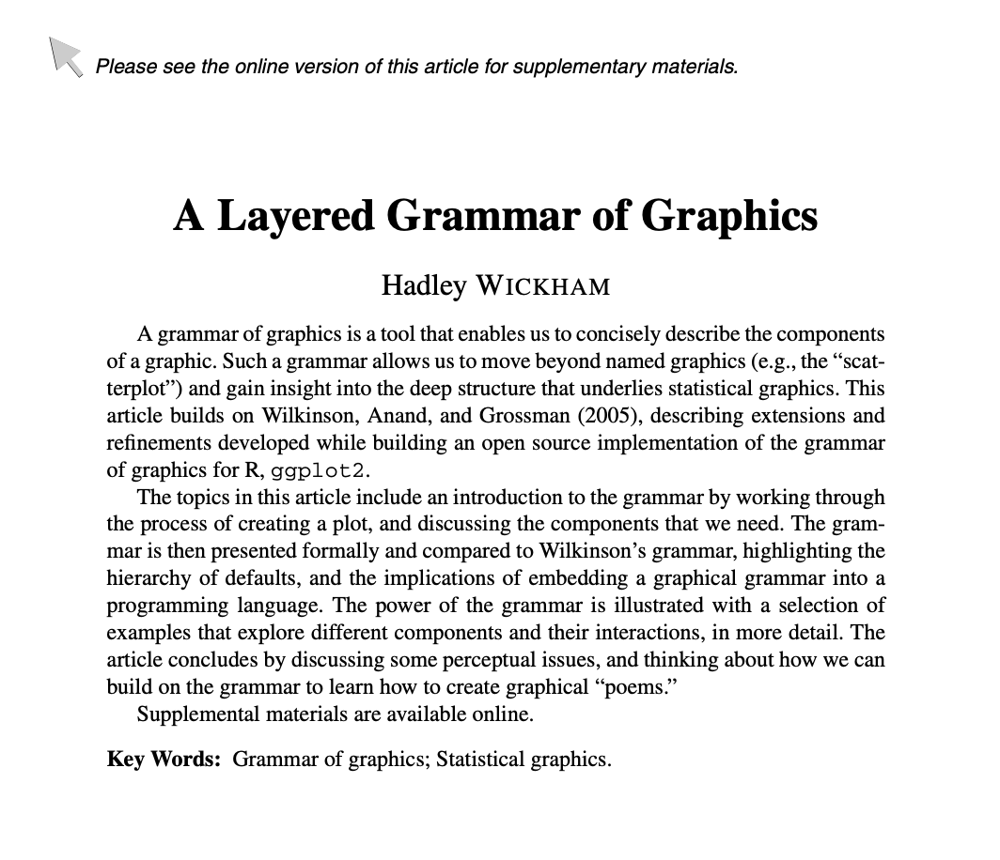
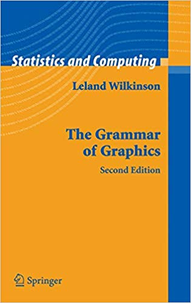
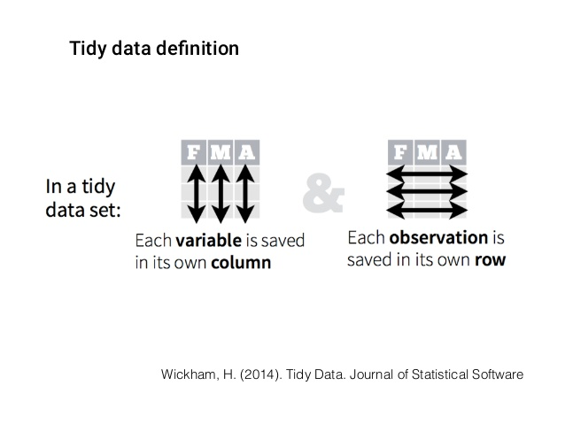
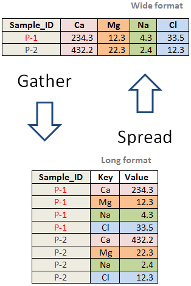
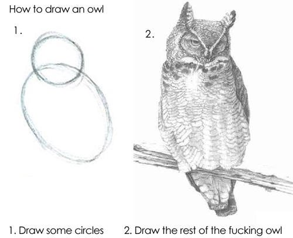

exclude: true
<style type="text/css">
code.r{
  font-size: 13px;
}
pre {
  font-size: 13px !important;
}
</style>
```{r setup, include=FALSE}
knitr::opts_chunk$set(fig.width=4.25, fig.height=3.5, fig.retina=3,
                      out.width = "100%",
                      message=FALSE, warning=FALSE, cache = TRUE, 
                      autodep = TRUE, hiline=TRUE)

knitr::opts_hooks$set(fig.callout = function(options) {
  if (options$fig.callout) {
    options$echo <- FALSE
    options$out.height <- "99%"
    options$fig.width <- 16
    options$fig.height <- 8
  }
  options
})

options(
  htmltools.dir.version = FALSE, 
  width = 90,
  max.print = 9999,
  knitr.table.format = "html"
)
as_table <- function(...) knitr::kable(..., format='html', digits = 3)
```

```{r include=FALSE}
knitr::opts_chunk$set(echo=TRUE)
knitr::opts_chunk$set(fig.height=6, out.width="100%")
library(ggplot2)
# reveal lines up to `upto` and highlight lines `highlight`
reveal <- function(name, upto, highlight = upto) {
  content <- knitr:::knit_code$get(name)
  content[upto] <- gsub("%>%\\s*(#.+)?$", "\\1", content[upto])
  content[upto] <- gsub("\\+\\s*(#.+)?$", "\\1", content[upto])
  content[upto] <- gsub("->\\s*(#.+)?$", "\\1", content[upto])	
  content[highlight] <- paste(content[highlight], "#<<")
  content[1:upto]
}

partial_knit_chunks <- function(chunk_name) {
  # Create slide for lines 1:N for each line N in the given chunk
  # idx_lines <- seq_along(knitr:::knit_code$get(chunk_name))
  
  code_split <- knitr:::knit_code$get(chunk_name)
  
  idx_lines <- sort(
    c(grep("\\)\\s?\\+|->|%>%\\s?$", code_split),
      grep("\\)\\s?$", code_split)) 
  )
  
  
  highlight <- list()
  
  for (i in 1:length(idx_lines)) {
    if (i == 1) {  
      highlight[[i]] <- 1
    } else {
      highlight[[i]] <- (idx_lines[i - 1] + 1):idx_lines[i]
    }
  }
  
  partial_knit_steps <- glue::glue(
    "class: bg-main1 split-40",
    "count: false",
    "",
    ".column[.content[",
    "```{r plot_{{chunk_name}}_{{idx_lines}}, eval=FALSE, code=reveal('{{chunk_name}}', {{idx_lines}}, {{highlight}})}",
    "```",
    "]]",
    ".column[.content.center[",
    "```{r output_{{chunk_name}}_{{idx_lines}}, echo=FALSE, code=reveal('{{chunk_name}}', {{idx_lines}}, {{highlight}})}",
    "```",
    "]]",
    .open = "{{", .close = "}}", .sep = "\n"
  )
  glue::glue_collapse(partial_knit_steps, "\n---\n")
}

```
---
class: split-two
<link rel="stylesheet" href="https://cdnjs.cloudflare.com/ajax/libs/font-awesome/4.7.0/css/font-awesome.min.css">
.column.bg-main1[
.font3.comfortaa.coral[R you ready to make charts?]
</br></br></br></br>
.font2.comfortaa[Will Chase]
.font_large.comfortaa[Philly dataviz meetup</br>
May 29, 2019]
</br>
.font_large[
<ul class="fa-ul">
        <li><i class="fa-li fa fa-twitter" id="icon"></i><a href="https://twitter.com/W_R_Chase" target="_blank">@W_R_Chase</a></li>
        <li><i class="fa-li fa fa-user" id="icon"></i><a href="williamrchase.com" target="_blank">williamrchase.com</a></li>
			</ul>
]
]
.column.bg-main3.center[
</br></br>
.vmiddle[]
]
---
class: bg-main1 split-20
.row[
# A little bit about me
]
.row[
.split-two[
.column[
</br></br>
- Data analyst and visualization specialist at Upenn </br></br>
- Brand new philly baby </br></br>
- Makes generative art </br></br>
- Likes dogs, audiobooks, and tweeting R memes
]

.column[
.font2[My R credentials*:]
</br>
<blockquote class="twitter-tweet" data-lang="en"><p lang="ro" dir="ltr">you: <br>data &lt;- read_csv(&quot;my_data.csv&quot;)<br>data2 &lt;- read_csv(&quot;my_data2.csv&quot;)<br>data3 &lt;- bind_rows(data, data2)<br><br>me, an intellectual: <br>data &lt;- <br>  here::here() %&gt;%<br>  dir_ls(regexp = &quot;\\.csv$&quot;) %&gt;% <br>  map_dfr(read_csv, .id = &quot;source&quot;)</p>&mdash; Will Chase (@W_R_Chase) <a href="https://twitter.com/W_R_Chase/status/1104588157792731138?ref_src=twsrc%5Etfw">March 10, 2019</a></blockquote>
<script async src="https://platform.twitter.com/widgets.js" charset="utf-8"></script>
.font-small[*credentials joke stolen from @nnstats]
]
]
]
---
class: bg-main1
# Dataviz in R == .coral["ggplot"]
</br></br>
.center[]
---
class: bg-main1

# .coral[ggplot] showcase

.center[]
---
class: bg-main1

# .coral[ggplot] showcase

.center[]
---
class: bg-main1

# .coral[ggplot] showcase

.center[]
---
class: bg-main1

# .coral[ggplot] showcase

.center[]
---
class: bg-main1

# .coral[ggplot] showcase

.center[]
---
class: bg-main1

# .coral[ggplot] showcase

.center[]
---
class: bg-main1

# .coral[ggplot] showcase

.center[]
---
class: bg-main1

# .coral[ggplot] showcase

.center[]
---
class: bg-main1 split-two
.column[
.font2[Things R is good at]
.font_large[
- Reproducibility </br></br>
- Free and open source</br></br>
- Fully customizable graphics</br></br>
- Interactive reports</br></br>
- A rich package ecosystem</br></br>
- An amazing community with lots of examples, tutorials, and learning resources</br></br>
]]
--
.column[
.font2[Some downsides]
.font_large[
- Interactive graphs aren't great</br></br>
- There is a learning curve</br></br>
- Corporate and tech cultural biases </br></br>
]]

---
class: bg-main1 split-20
.row[
# Sidebar: do you have a minute to talk about the tidyverse?
]
.row[
.split-two[
.column[


]
.column[
.font2[Some excellent resources:]
- https://evamaerey.github.io/tidyverse_in_action/tidyverse_in_action.html#1 </br></br>
- https://www.williamrchase.com/slides/intro_r_anthropology_2018#1 </br></br>
- https://stat545.com/topics.html </br></br>
- https://r4ds.had.co.nz/ </br></br>
- https://rfortherestofus.com/ </br></br>
]
]
]
---
class: bg-main1 split-20
.row[
## .coral[gg]plot implements a .coral[g]rammar of .coral[g]raphics
]
.row[
.split-two[
.column[

]
.column[

]
]
]
---
class: bg-main1 split-20
.row[
## .coral[gg]plot implements a .coral[g]rammar of .coral[g]raphics
]
.row[
.split-two[
.column[

]
.column[

]
]
]
---
class: bg-main5

</br></br></br></br>
.blue[*credit: @dgkeyes,] https://rfortherestofus.com/
---
class: bg-main1
# .red[Warning]: ugly plots ahead
 </br>
--
.font2[We are about to make a lot of ugly plots... that's ok!] </br></br>
--
.font2[Our main goal is to get something on the screen, and build/tweak it bit by bit]
---
class: bg-main1
## Get to know our data
</br>
```{r echo=FALSE}
library(dplyr)
library(DT)
data <- readr::read_csv("https://gist.githubusercontent.com/will-r-chase/16827fa79e02af9e3a0651fb0d79b426/raw/92b321a8bc4d98e463156ef03a5da5cf05065704/freedom_clean.csv") 
hfi <- 
  data %>%
  select(year, countries, region_simple, ef_score, pf_score, gdp_ppp_cap, gdp_rank, population, pop_rank) %>%
  mutate(pf_score = round(pf_score, 2), gdp = round(gdp_ppp_cap, 2)) %>%
  select(-gdp_ppp_cap)
datatable(hfi, rownames = FALSE, fillContainer = FALSE, height = "auto", width = 1200, options = list(scrollX = TRUE, pageLength = 5))
```

---
class: bg-main1
## Always be prepared

.pull-left[]
.pull-right[]

---
class: bg-main1 split-20
.row[
## The anatomy of a ggplot
]
.row[
.split-two[
.column[
```{r echo=TRUE, eval=FALSE}
library(ggplot2)

ggplot(data = hfi_2016) +
  geom_point(aes(x = population, 
                 y = gdp, 
                 size = ef_score, 
                 color = region_simple), 
             alpha = 0.5) +
  scale_color_manual(values = c("#168B98", "#ED5B67", 
                                "#E27766", "#DAAD50", 
                                "#EAC3A6")) +
  theme_minimal() 
```
]
.column[
```{r echo=FALSE, eval=TRUE}
library(ggplot2)

hfi_2016 <- hfi %>% filter(year == 2016)

ggplot(data = hfi_2016) +
  geom_point(aes(x = population, 
                 y = gdp, 
                 size = ef_score, 
                 color = region_simple), 
             alpha = 0.5) +
  scale_color_manual(values = c("#168B98", "#ED5B67", 
                                "#E27766", "#DAAD50", 
                                "#EAC3A6")) +
  theme_minimal() 
```
]
]
]
---
class: bg-main1
# .coral[aes]thetics and .coral[geom]etric objects
</br></br>
.font2[.coral[geom]etric objects (geoms) are the shape or visual representation of our data]
- `geom_*` point, line, bar, polygon, boxplot, ...
--
</br></br>
.font2[.coral[aes]thetics map data to geoms]
- `aes(...)` x, y, size, color, fill, shape, ...
--
</br></br>
.font2[.coral[aesthetics] are what you plot, .coral[geoms] are how you plot them]
---
class: bg-main1

```{r aesthetic, eval=F, echo=F}
ggplot(data = hfi_2016) +
  geom_point(aes(x = pop_rank, 
                 y = gdp_rank, 
                 size = ef_score))
```

`r paste(knitr::knit(text = partial_knit_chunks("aesthetic")), collapse = "\n")`

```{css, eval=TRUE}
.remark-code{ line-height: 2; }
```

---
class: bg-main1 split-two

.column[
```{r eval=F, echo=T}
ggplot(data = hfi_2016) +
  aes(x = pop_rank, y = gdp_rank, size = ef_score) + #<<
  geom_point() 
```
]
.column[
```{r eval=T, echo=F}
ggplot(data = hfi_2016) +
  aes(x = pop_rank, y = gdp_rank, size = ef_score) +
  geom_point() 
```
]

---
class: bg-main1 split-two

.column[
```{r eval=F, echo=T}
ggplot() +
  aes(x = pop_rank, y = gdp_rank, size = ef_score) +
  geom_point(data = hfi_2016) #<<
```
]
.column[
```{r eval=T, echo=F}
ggplot() +
  aes(x = pop_rank, y = gdp_rank, size = ef_score) +
  geom_point(data = hfi_2016) 
```
]
---
class: bg-main1
# Different strokes for different folks

.font2[You'll find that often times there are many ways to do the same thing in ggplot, this is confusing]
</br></br>
--
.font2[I recommend]
.font_large[
- specify data in the initial `ggplot()` call if using the same dataset for all geoms, else specify it in each `geom_` </br></br>
- specify `aes()` inside of every `geom_()` so it is clear which aesthetics belong with which geoms</br></br>
- always use named arguments
]
---
class: bg-main1 
# Understanding .coral[aes]thetics
</br></br></br>
.font2[Properties inside of `aes()` will style elements dynamically, based on your data] </br></br></br>
--
.font2[Properties outside of `aes()` will apply the same style to every visual element]

---
class: bg-main1 split-two
.column[
```{r eval=F, echo=T}
ggplot(data = hfi_2016) +
  geom_point(aes(x = pop_rank, y = gdp_rank, size = ef_score), 
             color = "blue") #<<
```
]
.column[
```{r eval=T, echo=F}
ggplot(data = hfi_2016) +
  geom_point(aes(x = pop_rank, y = gdp_rank, size = ef_score), 
             color = "blue")
```
]
---
class: bg-main1 split-two
.column[
```{r eval=F, echo=T}
ggplot(data = hfi_2016) +
  geom_point(aes(x = pop_rank, y = gdp_rank, size = ef_score, 
                 color = region_simple)) #<<
```
]
.column[
```{r eval=T, echo=F}
ggplot(data = hfi_2016) +
  geom_point(aes(x = pop_rank, y = gdp_rank, size = ef_score, color = region_simple))
```
]
---
class: bg-main1
# But how do I know what .coral[aes]thetics to use?

.center[]</br></br>

.font2[.red[required] vs. optional aesthetics] </br></br>

https://ggplot2.tidyverse.org/reference/index.html
---
class: bg-main1 split-two
.column[
```{r eval=F, echo=T}
ggplot(data = hfi_2016) +
  geom_point(aes(x = pop_rank, y = gdp_rank, size = ef_score, 
                 color = region_simple)) 
```
]
.column[
```{r eval=T, echo=F}
ggplot(data = hfi_2016) +
  geom_point(aes(x = pop_rank, y = gdp_rank, size = ef_score, color = region_simple))
```
]
---
class: bg-main1 split-two
.column[
```{r eval=F, echo=T}
ggplot(data = hfi_2016) +
  geom_point(aes(x = pop_rank, y = gdp_rank, size = ef_score, 
                 color = region_simple), alpha = 0.5) #<<
```
]
.column[
```{r eval=T, echo=F}
ggplot(data = hfi_2016) +
  geom_point(aes(x = pop_rank, y = gdp_rank, size = ef_score, color = region_simple), alpha = 0.5)
```
]
---
class: bg-main1
# Now make the rest of the plot...
</br></br>
.center[]
---
class: bg-main1
# Scales
</br></br>
.font2[Scales map your input data to an output range] </br></br></br>
.font2[specify with `scale_*()` (ie. `scale_color_gradient()`, `scale_x_discrete()`)]
---
class: bg-main1 split-two
.column[
```{r eval=F, echo=T}
ggplot(data = hfi_2016) +
  geom_point(aes(x = pop_rank, y = gdp_rank, size = ef_score, 
                 color = region_simple), alpha = 0.5) #<<
```
]
.column[
```{r eval=T, echo=F}
ggplot(data = hfi_2016) +
  geom_point(aes(x = pop_rank, y = gdp_rank, size = ef_score, color = region_simple), alpha = 0.5)
```
]
---
class: bg-main1 split-two
.column[
```{r eval=F, echo=T}
ggplot(data = hfi_2016) +
  geom_point(aes(x = pop_rank, y = gdp_rank, size = ef_score, 
                 color = region_simple), alpha = 0.5) +
  scale_color_manual(values = c("#596F7E", "#168B98", "#ED5B67", "#fd8f24","#919c4c")) #<<
```
]
.column[
```{r eval=T, echo=F}
ggplot(data = hfi_2016) +
  geom_point(aes(x = pop_rank, y = gdp_rank, size = ef_score, color = region_simple), alpha = 0.5) +
  scale_color_manual(values = c("#596F7E", "#168B98", "#ED5B67", "#fd8f24","#919c4c"))
```
]
---
class: bg-main1 split-two
.column[
```{r eval=F, echo=T}
ggplot(data = hfi_2016) +
  geom_point(aes(x = pop_rank, y = gdp_rank, size = ef_score, 
                 color = region_simple), alpha = 0.5) +
  scale_color_manual(values = c("#596F7E", "#168B98", "#ED5B67", 
                                "#fd8f24","#919c4c")) +
  scale_size(range = c(0.5, 8)) #<<
```
]
.column[
```{r eval=T, echo=F}
ggplot(data = hfi_2016) +
  geom_point(aes(x = pop_rank, y = gdp_rank, size = ef_score, color = region_simple), alpha = 0.5) +
  scale_color_manual(values = c("#596F7E", "#168B98", "#ED5B67", "#fd8f24","#919c4c")) +
  scale_size(range = c(0.5, 8))
```
]
---
class: bg-main1
# Themes

.font2[Apply an overall theme with "pre-baked" themes eg. `theme_light()`]
.font_large[
- see the ggthemes package
]
.font2[Tweak individual element styles with `theme(...)`]
.font_large[
- within `theme()` we must specify what type of element each component should be
- styles are applied within the `element_()` call
- `element_text()`, `element_line()`, `element_rect()`, `element_blank()`
]
---
class: bg-main1 split-two
.column[
```{r eval=F, echo=T}
ggplot(data = hfi_2016) +
  geom_point(aes(x = pop_rank, y = gdp_rank, size = ef_score, 
                 color = region_simple), alpha = 0.5) +
  scale_color_manual(values = c("#596F7E", "#168B98", "#ED5B67", 
                                "#fd8f24","#919c4c")) +
  scale_size(range = c(0.5, 8)) #<<
```
]
.column[
```{r eval=T, echo=F}
ggplot(data = hfi_2016) +
  geom_point(aes(x = pop_rank, y = gdp_rank, size = ef_score, color = region_simple), alpha = 0.5) +
  scale_color_manual(values = c("#596F7E", "#168B98", "#ED5B67", "#fd8f24","#919c4c")) +
  scale_size(range = c(0.5, 8))
```
]
---
class: bg-main1 split-two
.column[
```{r eval=F, echo=T}
ggplot(data = hfi_2016) +
  geom_point(aes(x = pop_rank, y = gdp_rank, size = ef_score, 
                 color = region_simple), alpha = 0.5) +
  scale_color_manual(name = "Region", values = c("#596F7E", "#168B98", "#ED5B67", "#fd8f24","#919c4c")) + #<<
  scale_size(range = c(0.5, 8), guide = "none") #<<
```
]
.column[
```{r eval=T, echo=F}
ggplot(data = hfi_2016) +
  geom_point(aes(x = pop_rank, y = gdp_rank, size = ef_score, color = region_simple), alpha = 0.5) +
  scale_color_manual(name = "Region", values = c("#596F7E", "#168B98", "#ED5B67", "#fd8f24","#919c4c")) +
  scale_size(range = c(0.5, 8), guide = "none")
```
]
---
class: bg-main1 split-two
.column[
```{r eval=F, echo=T}
ggplot(data = hfi_2016) +
  geom_point(aes(x = pop_rank, y = gdp_rank, size = ef_score, 
                 color = region_simple), alpha = 0.5) +
  scale_color_manual(name = "Region", values = c("#596F7E", "#168B98", "#ED5B67", "#fd8f24","#919c4c")) + 
  scale_size(range = c(0.5, 8), guide = "none") +
  theme_minimal(base_size = 14) #<<
```
]
.column[
```{r eval=T, echo=F}
ggplot(data = hfi_2016) +
  geom_point(aes(x = pop_rank, y = gdp_rank, size = ef_score, color = region_simple), alpha = 0.5) +
  scale_color_manual(name = "Region", values = c("#596F7E", "#168B98", "#ED5B67", "#fd8f24","#919c4c")) +
  scale_size(range = c(0.5, 8), guide = "none") +
  theme_minimal(base_size = 14)
```
]
---
class: bg-main1 split-two
.column[
```{r eval=F, echo=T}
ggplot(data = hfi_2016) +
  geom_point(aes(x = pop_rank, y = gdp_rank, size = ef_score, 
                 color = region_simple), alpha = 0.5) +
  scale_color_manual(name = "Region", values = c("#596F7E", "#168B98", "#ED5B67", "#fd8f24","#919c4c")) + 
  scale_size(range = c(0.5, 8), guide = "none") +
  theme_minimal(base_size = 14) +
  theme(plot.background = element_rect(fill = "#F5F5F2")) #<<
```
]
.column[
```{r eval=T, echo=F}
ggplot(data = hfi_2016) +
  geom_point(aes(x = pop_rank, y = gdp_rank, size = ef_score, color = region_simple), alpha = 0.5) +
  scale_color_manual(name = "Region", values = c("#596F7E", "#168B98", "#ED5B67", "#fd8f24","#919c4c")) +
  scale_size(range = c(0.5, 8), guide = "none") +
  theme_minimal(base_size = 14) +
  theme(plot.background = element_rect(fill = "#F5F5F2")) 
```
]
---
class: bg-main1 split-two
.column[
```{r eval=F, echo=T}
ggplot(data = hfi_2016) +
  geom_point(aes(x = pop_rank, y = gdp_rank, size = ef_score, 
                 color = region_simple), alpha = 0.5) +
  scale_color_manual(name = "Region", values = c("#596F7E", "#168B98", "#ED5B67", "#fd8f24","#919c4c")) + 
  scale_size(range = c(0.5, 8), guide = "none") +
  theme_minimal(base_size = 14) +
  theme(plot.background = element_rect(fill = "#F5F5F2"),
        legend.position = "bottom") #<<
```
]
.column[
```{r eval=T, echo=F}
ggplot(data = hfi_2016) +
  geom_point(aes(x = pop_rank, y = gdp_rank, size = ef_score, color = region_simple), alpha = 0.5) +
  scale_color_manual(name = "Region", values = c("#596F7E", "#168B98", "#ED5B67", "#fd8f24","#919c4c")) +
  scale_size(range = c(0.5, 8), guide = "none") +
  theme_minimal(base_size = 14) +
  theme(plot.background = element_rect(fill = "#F5F5F2"),
        legend.position = "bottom") 
```
]
---
class: bg-main1 split-two
.column[
```{r eval=F, echo=T}
ggplot(data = hfi_2016) +
  geom_point(aes(x = pop_rank, y = gdp_rank, size = ef_score, 
                 color = region_simple), alpha = 0.5) +
  scale_color_manual(name = "Region", values = c("#596F7E", "#168B98", "#ED5B67", "#fd8f24","#919c4c")) + 
  scale_size(range = c(0.5, 8), guide = "none") +
  theme_minimal(base_size = 14) +
  theme(plot.background = element_rect(fill = "#F5F5F2"),
        legend.position = "bottom", 
        panel.grid.minor = element_blank()) #<<
```
]
.column[
```{r eval=T, echo=F}
ggplot(data = hfi_2016) +
  geom_point(aes(x = pop_rank, y = gdp_rank, size = ef_score, color = region_simple), alpha = 0.5) +
  scale_color_manual(name = "Region", values = c("#596F7E", "#168B98", "#ED5B67", "#fd8f24","#919c4c")) +
  scale_size(range = c(0.5, 8), guide = "none") +
  theme_minimal(base_size = 14) +
  theme(plot.background = element_rect(fill = "#F5F5F2"),
        legend.position = "bottom",
        panel.grid.minor = element_blank()) 
```
]
---
class: bg-main1 split-two
.column[
```{r eval=F, echo=T}
ggplot(data = hfi_2016) +
  geom_point(aes(x = pop_rank, y = gdp_rank, size = ef_score, 
                 color = region_simple), alpha = 0.5) +
  scale_color_manual(name = "Region", values = c("#596F7E", "#168B98", "#ED5B67", "#fd8f24","#919c4c")) + 
  scale_size(range = c(0.5, 8), guide = "none") +
  theme_minimal(base_size = 14) +
  theme(plot.background = element_rect(fill = "#F5F5F2"),
        legend.position = "bottom", 
        panel.grid.minor = element_blank()) +
  labs(title = "My first bubble plot", #<<
       x = "Population rank", #<<
       y = "GDP rank") #<<
```
]
.column[
```{r eval=T, echo=F}
ggplot(data = hfi_2016) +
  geom_point(aes(x = pop_rank, y = gdp_rank, size = ef_score, color = region_simple), alpha = 0.5) +
  scale_color_manual(name = "Region", values = c("#596F7E", "#168B98", "#ED5B67", "#fd8f24","#919c4c")) +
  scale_size(range = c(0.5, 8), guide = "none") +
  theme_minimal(base_size = 14) +
  theme(plot.background = element_rect(fill = "#F5F5F2"),
        legend.position = "bottom",
        panel.grid.minor = element_blank()) +
  labs(title = "My first bubble plot",
       x = "Population rank", 
       y = "GDP rank") 
```
]
---
class: bg-main1
.center[]
---
class: bg-main1
# Time for some anxiety-inducing .coral[live coding]?

.center[]
---
class: bg-main1
.center[]
---
class: bg-main1
# .coral[Bonus] round

.font_large[
- Rayshader </br></br>
- gganimate </br></br>
- Rmarkdown</br></br>
- HTMLwidgets</br></br>
- Flexdashboard</br></br>
- Shiny</br></br>
]
---
class: bg-main1
## .coral[Document] your analyses, make a .coral[website], make .coral[slides]... the world is your oyster!
.center[]
---
class: bg-main1
# Where can I .coral[learn] more </br>
--
.font_small[The #rstats community!]


</br>
.font_large[R ladies philly! http://rladiesphilly.org/]
</br>
.font_large[@dataandme @WeAreRLadies] </br></br>
--
.font_large[ggplot flipbook! </br>]
https://evamaerey.github.io/ggplot_flipbook/ggplot_flipbook_xaringan.html#1 </br></br>
--
.font_large[Free dataviz in R books! </br>]
https://serialmentor.com/dataviz/ </br>
https://socviz.co/index.html#preface </br>
--
.font_large[How to google (Programming is professional googling)</br>]
http://datacarpentry.org/semester-biology/materials/googling-for-help/
---


```{css, eval=TRUE, echo=FALSE}
.remark-code{ line-height: 2; }
```
---
   
 
