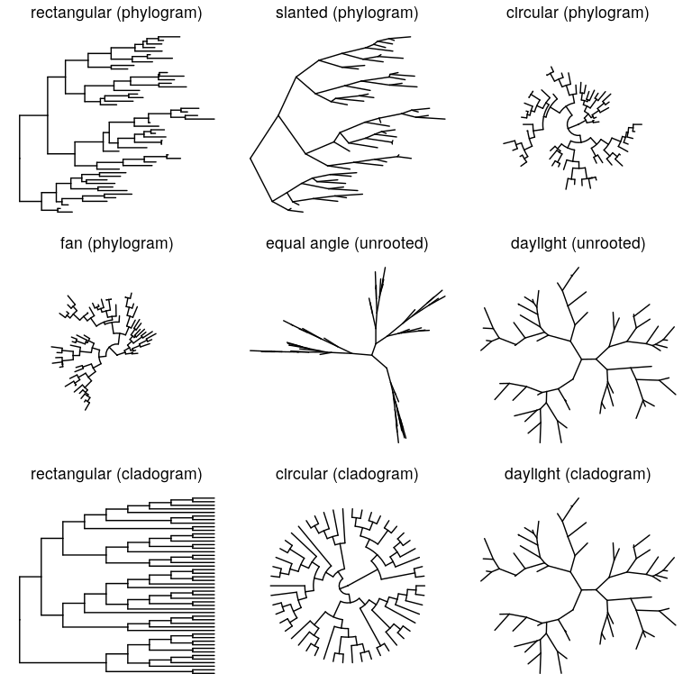
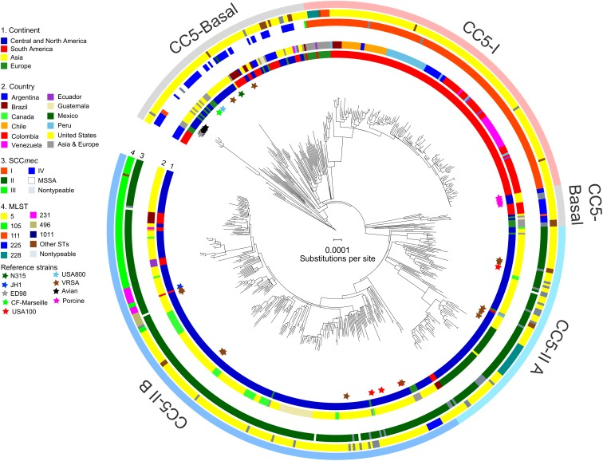
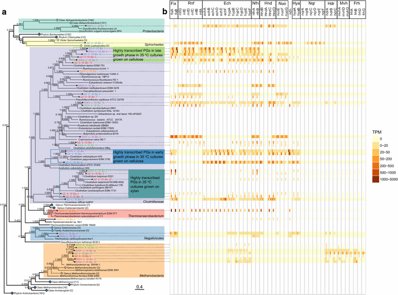
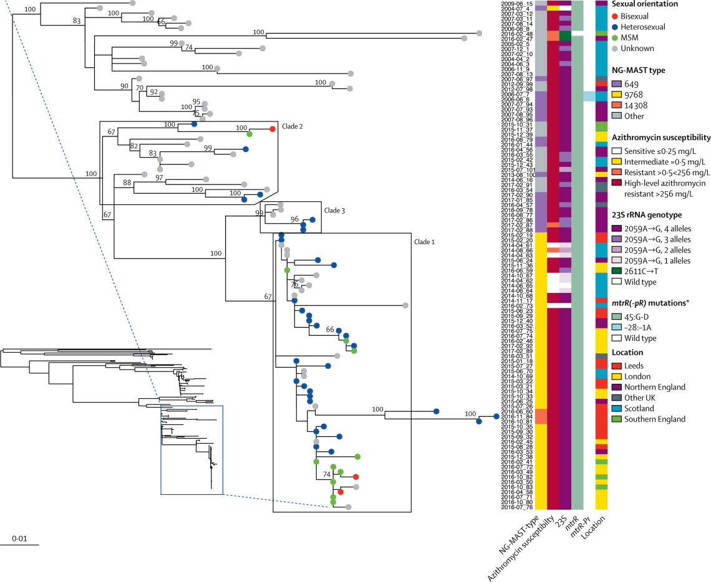
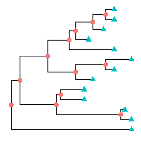

exclude: true
<style type="text/css">
code.r{
  font-size: 16px;
}
pre {
  font-size: 16px !important;
}
</style>

```{r setup, include=FALSE}
options(htmltools.dir.version = FALSE)
```

---
class: split-two
<link rel="stylesheet" href="https://cdnjs.cloudflare.com/ajax/libs/font-awesome/4.7.0/css/font-awesome.min.css">
.column.bg-main1[
.font3[Visualizing Phylogenetic Trees in R with ggtree]
</br></br></br></br></br>
.font3[Will Chase]
</br>
.font_large[
<ul class="fa-ul">
<li><i class="fa-li fa fa-envelope" id="icon"></i><a href="mailto:wchase14@gmail.com" target="_blank">wchase14@gmail.com</a></li>
<li><i class="fa-li fa fa-user" id="icon"></i><a href="williamrchase.com" target="_blank">williamrchase.com</a></li>
<li><i class="fa-li fa fa-github" id="icon"></i><a href="https://github.com/will-r-chase" target="_blank">github.com/will-r-chase</a></li>
<li><i class="fa-li fa fa-twitter" id="icon"></i><a href="https://twitter.com/W_R_Chase" target="_blank">@W_R_Chase</a></li>
</ul>
]]
.column.bg-main3.center[
</br></br></br></br>

]
---
class: split-two

.column.bg-main1[
#What is .yellow[ggtree?]
</br></br></br>
.font_large[
+ Implements a .yellow[grammer of graphics] for phylogenetic trees
</br></br>
+ Facilitates visualization of phyloenies with .yellow[associated data]
</br></br>
+ Helpers for .yellow[tree manipulation] and .yellow[data import]
]]
.column.bg-main3[

]
---
class: bg-main1

# Applications

--

## .yellow[Molecular evolution/genetics]

--

## Morphological phylogenies

--

## .yellow[Linguistic dendrograms]

--

## Any other character based dendrogram
---
class: bg-main1
# What can you do with .yellow[ggtree?]
</br></br>
.center[]
---
class: bg-main1
# What can you do with .yellow[ggtree?]
</br></br>
.center[]
---
class: bg-main1
# What can you do with .yellow[ggtree?]
</br></br>
.center[]
---
class: bg-main1
# What can you do with .yellow[ggtree?]
</br></br>
.center[]
---
class: bg-main1
# How to plot a .yellow[ggtree?]

.font_large[easy, it's just like ggplot!]

`ggtree(tree) + geom_point(aes(shape=isTip, color=isTip), size=3)`


---
class: bg-main1
# Getting data into ggtree

.font_large[treeio package provides functions for reading and writing phylogenetic data]
.center[]
.font_large[supports .yellow[newick, nexus, phylip, .nhx, jplace]]

---
class: bg-main1

# treeio supports:

--

## BEAST

--

## RAxML

--

## MrBayes

--

## HyPhy

--

## RevBayes

--

## PPlacer

--

## r8s

--

## more!

---
class: bg-main1

# Tidytree

## Uses .yellow[tidy data] principles to allow manipulation of `phylo` objects

`x <- as_tibble(tree)` </br>
`x`</br>
`A tibble: 7 x 4`</br>
`parent  node branch.length label`</br>
`<int> <int>         <dbl> <chr>`</br>
`1      7     1       0.472   t2  ` </br>
`2      7     2       0.274   t1   `</br>
`3      6     3       0.674   t4  ` </br>
`4      5     4       0.00202 t3   `</br>
`5      5     5       NA      <NA> `</br>
`6      5     6       0.0393  <NA> `</br>
`7      6     7       0.435   <NA>`</br>
---
class: bg-main1

# Makes manipulating trees, adding tree data easy

`parent()` </br>
`child()`</br>
`MRCA()`</br>

# Allows easy grouping for annotation

`group_clade()`</br>
`group_OTU()`</br>

---
class: bg-main1
# Go make some trees!

.center[]
---
class: bg-main1
.center.yellow[
# Thank You!
]
</br>
.center[]
</br></br>
.center.font_large[Questions?]