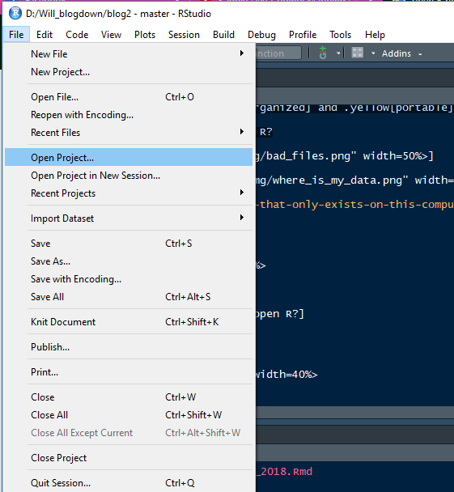
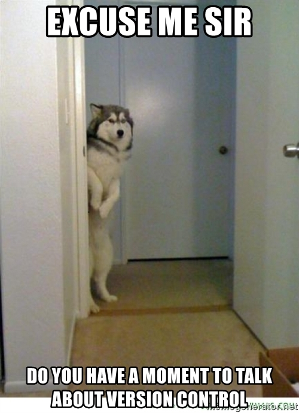

```{r setup, include=FALSE}
options(htmltools.dir.version = FALSE)
```

class: middle center bg-main1

# Why am I here?

--
### -Teach you how to code in R `r emo::ji("x")`

--
### -Teach you how you *should* use R `r emo::ji("heavy_check_mark")`

--
### -Teach you how to make writing R code enjoyable `r emo::ji("heavy_check_mark")`

--
### -Teach you how to learn R `r emo::ji("heavy_check_mark")`

---
class: middle bg-main1

# How most academics learn R


---
class: middle bg-main1

# How .yellow[should] you use R?

---
layout: true
class: split-two with-border border-white

.column[
  .split-three[
  .row.bg-main1[.content.font2[
Write .yellow[organized] and .yellow[portable] R code
  ]]
  .row.bg-main2[.content.font2[
Write .yellow[readable] R code
  ]]
  .row.bg-main3[.content.font2[
Document, share, and .yellow[learn] more R code
]]
]]

.column.bg-main1[.content.center.vmiddle[
{{content}}
]]

---
class: hide-row2-col1 hide-row3-col1


---
class: hide-row3-col1

---
class:


---
class: fade-row2-col1 fade-row3-col1
---
layout: false
class: bg-main1

# Making your R work .yellow[organized] and .yellow[portable]
.blockquote.font_large[
One day you will need to quit R, go do something else and return to your analysis later.</br></br>
One day you will have multiple analyses going that use R and you want to keep them separate.</br></br>
One day you will need to bring data from the outside world into R and send numerical results and figures from R back    out into the world.</br>
]
 
---
class: bg-main1

# Making your R work .yellow[organized] and .yellow[portable]
.blockquote.font_large[
One day you will need to quit R, go do something else and return to your analysis later.</br></br>
One day you will have multiple analyses going that use R and you want to keep them separate.</br></br>
One day you will need to bring data from the outside world into R and send numerical results and figures from R back    out into the world.</br>
</br> 
</br>
To handle these real life situations, you need to make two decisions:</br>
]
 
---
class: bg-main1

# Making your R work .yellow[organized] and .yellow[portable]
.blockquote.font_large[
One day you will need to quit R, go do something else and return to your analysis later.</br></br>
One day you will have multiple analyses going that use R and you want to keep them separate.</br></br>
One day you will need to bring data from the outside world into R and send numerical results and figures from R back    out into the world.</br>
</br> 
</br>
To handle these real life situations, you need to make two decisions:</br>
1. What about your analysis is “real”, i.e. you will save it as your lasting record of what happened?</br>
]
 
---
class: bg-main1

# Making your R work .yellow[organized] and .yellow[portable]
.blockquote.font_large[
One day you will need to quit R, go do something else and return to your analysis later.</br></br>
One day you will have multiple analyses going that use R and you want to keep them separate.</br></br>
One day you will need to bring data from the outside world into R and send numerical results and figures from R back    out into the world.</br>
</br> 
</br>
To handle these real life situations, you need to make two decisions:</br>
1. What about your analysis is “real”, i.e. you will save it as your lasting record of what happened?</br>
2. Where does your analysis “live”?</br>
</br>
-_Jenny Bryan_
]
 
---
class: bg-main1

# Making your R work .yellow[organized] and .yellow[portable]
##What about your analysis is .yellow["real"]
</br>
-"Interactive" typing of your code
--
```{r}
x <- 5
y <- 10

x + y
```
--
</br>
-Saving your code as a script <-- .yellow["real"]
</br>
--
.center[]
---
class: bg-main1

# Making your R work .yellow[organized] and .yellow[portable]
##Where does your analysis .yellow["live"]
</br>
</br>
</br>
###Setting your working directory (path)
</br>
</br>
`setwd(C:/users/will/my_data)`
</br>
</br>
`getwd()`
---
class: bg-main1

#What do you do when you open R?
</br>
</br>
--
.float-left[]
--
.float-right[]
---
class: bg-main1

.float-left[]
--
.float-right[]
--
</br>
</br>
.font_large[`setwd(will/folder-that-only-exists-on-this-computer)`]

---
class: bg-main1 vmiddle center


---
class: split-25 bg-main1 with-border

.row[
#What .yellow[should] you do when you open R?]
.row[
  .split-three.with-border[
  .column.bg-orange[.content[
#Open (or make) an R project


    ]]
  .column[.content[
  
  ]]
  .column[.content[
  
  ]]
]]
---
class: bg-main1

#What is an R project?
.font_large[
+ A way to keep all files (scripts, inputs, figures) associated with a project organized in one place</br></br>

]
---
class: bg-main1

#What is an R project?
.font_large[
+ A way to keep all files (scripts, inputs, figures) associated with a project organized in one place</br></br>
+ Many useful options for saving your R history or environment</br></br>

]
---
class: bg-main1

#What is an R project?
.font_large[
+ A way to keep all files (scripts, inputs, figures) associated with a project organized in one place</br></br>
+ Many useful options for saving your R history or environment</br></br>
+ keeps your files and scripts in a centralized working directory</br></br>

]
---
class: bg-main1

#What is an R project?
.font_large[
+ A way to keep all files (scripts, inputs, figures) associated with a project organized in one place</br></br>
+ Many useful options for saving your R history or environment</br></br>
+ keeps your files and scripts in a centralized working directory</br></br>
+ allows for version control and portability</br>
]
---
class: bg-main1

#What is an R project?
.font_large[
+ A way to keep all files (scripts, inputs, figures) associated with a project organized in one place</br></br>
+ Many useful options for saving your R history or environment</br></br>
+ keeps your files and scripts in a centralized working directory</br></br>
+ allows for version control and portability</br>
]


---
class: split-25 bg-main1 fade-row2-col1 with-border

.row[
#What .yellow[should] you do when you open R?]
.row[
  .split-three.with-border[
  .column[.content[
#Open (or make) an R project


    ]]
  .column.bg-orange[.content[
#git pull
.center[]
  ]]
  .column[.content[
  
  ]]
]]
---
class: bg-main1 vmiddle


---
class: bg-main1 
#What is version control?
--
.center[]
---
class: bg-main1 vmiddle center

---
class: bg-main1
#Integrate GitHub with R projects

.float-left[]
--
.float-right[]
--
.font_large[This guide by Hadley Wickham is my all-time favorite explanation of git/github and how it integrates with R]
</br>
</br>
.font_large[<a href="http://r-pkgs.had.co.nz/git.html" target="_blank">http://r-pkgs.had.co.nz/git.html</a>]
---
class: split-25 bg-main1 fade-row2-col1 fade-row2-col2 with-border

.row[
#What .yellow[should] you do when you open R?]
.row[
  .split-three.with-border[
  .column[.content[
#Open (or make) an R project


    ]]
  .column[.content[
#git pull
.center[]
  ]]
  .column.bg-orange[.content[
#Write code, save scripts and results, commit change, and push to github
  
  ]]
]]
---
class: bg-main1 
#Now, just write the code...
</br>
</br>
--
.center[]
---
class: split-two with-border border-white fade-row1-col1 fade-row3-col1

.column[
  .split-three[
  .row.bg-main1[.content.font2[
Write .yellow[organized] and .yellow[portable] R code
  ]]
  .row.bg-main2[.content.font2[
Write .yellow[readable] R code
  ]]
  .row.bg-main3[.content.font2[
Document, share, and .yellow[learn] more R code
]]
]]

.column.bg-main1[.content.center.vmiddle[

]]
---
class: bg-main1
#What is the .yellow[tidyverse?]
</br>
</br>
.center[]
---
class: bg-main1
#What is the .yellow[tidyverse?]
</br>
</br>
.center[]
---
class: bg-main1
#Why use the .yellow[tidyverse?]
</br>
</br>
.font_large[
+ Makes coding simpler
]
---
class: bg-main1
#Why use the .yellow[tidyverse?]
</br>
</br>
.font_large[
+ Makes coding simpler
</br>
</br>
+ Makes code human-readable
]
---
class: bg-main1
#Why use the .yellow[tidyverse?]
</br>
</br>
.font_large[
+ Makes coding simpler
</br>
</br>
+ Makes code human-readable
</br>
</br>
+ Makes coding more fun and enjoyable
]
---